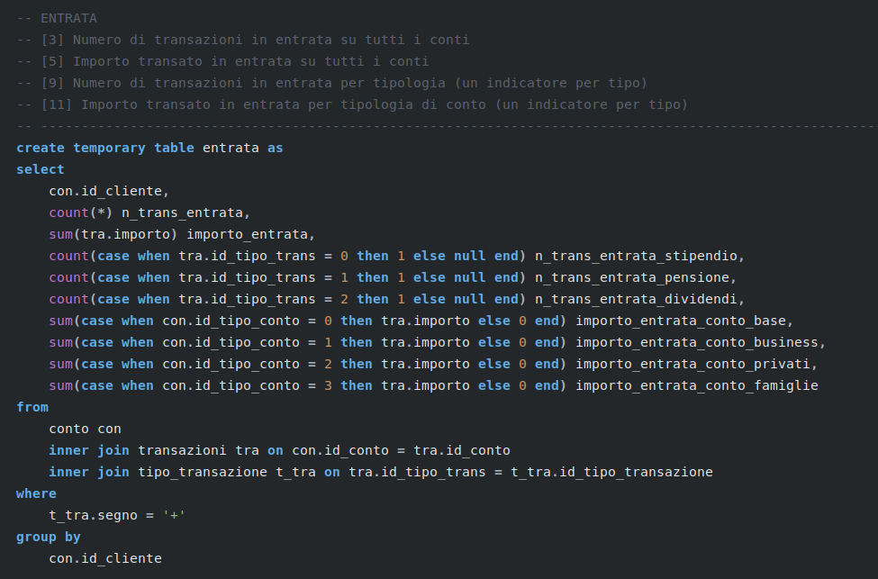

# sql-analisi-banca
Creare una tabella denormalizzata che contenga indicatori comportamentali sul cliente, calcolati sulla base delle transazioni e del possesso prodotti. Lo scopo è creare le feature per un possibile modello di machine learning supervisionato.

# Descrizione
Viene fornito un database bancario `db_bancario.sql` costituito dalle tabelle `cliente`, `conto`, `tipo_conto`, `tipo_transazione`, `transazioni`.  
Usando le temporary table, per ogni cliente vengono creati i seguenti indicatori (riferiti all'id_cliente):

* Età
* Numero di transazioni in uscita su tutti i conti
* Numero di transazioni in entrata su tutti i conti
* Importo transato in uscita su tutti i conti
* Importo transato in entrata su tutti i conti
* Numero totale di conti posseduti
* Numero di conti posseduti per tipologia (un indicatore per tipo)
* Numero di transazioni in uscita per tipologia (un indicatore per tipo)
* Numero di transazioni in entrata per tipologia (un indicatore per tipo)
* Importo transato in uscita per tipologia di conto (un indicatore per tipo)
* Importo transato in entrata per tipologia di conto (un indicatore per tipo)

Esempio di una temporary table usata durante la costruzione della tabella finale:

